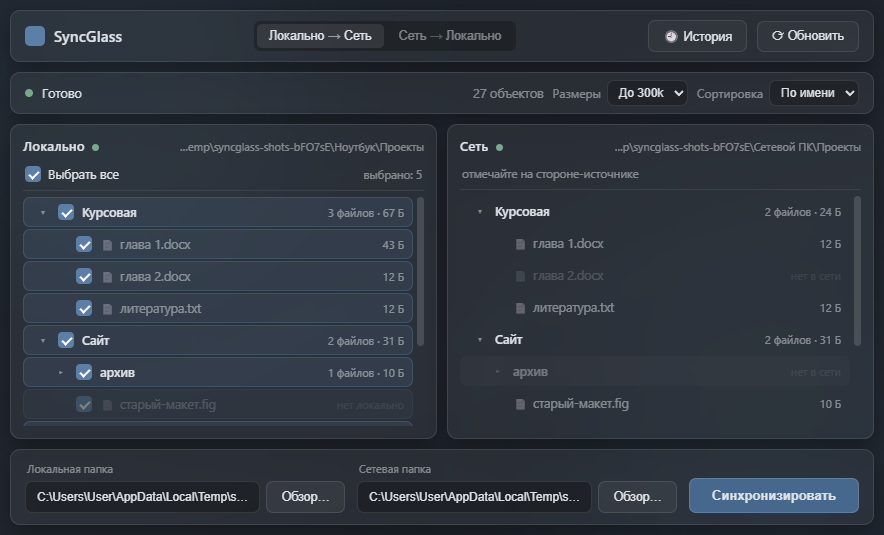
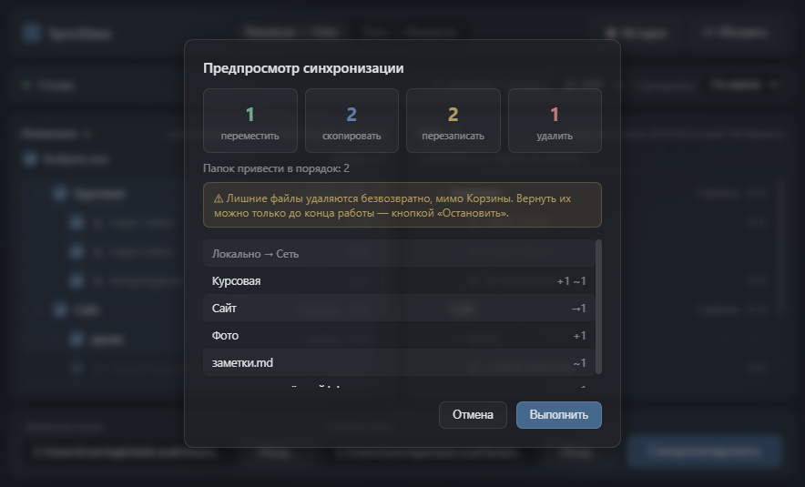
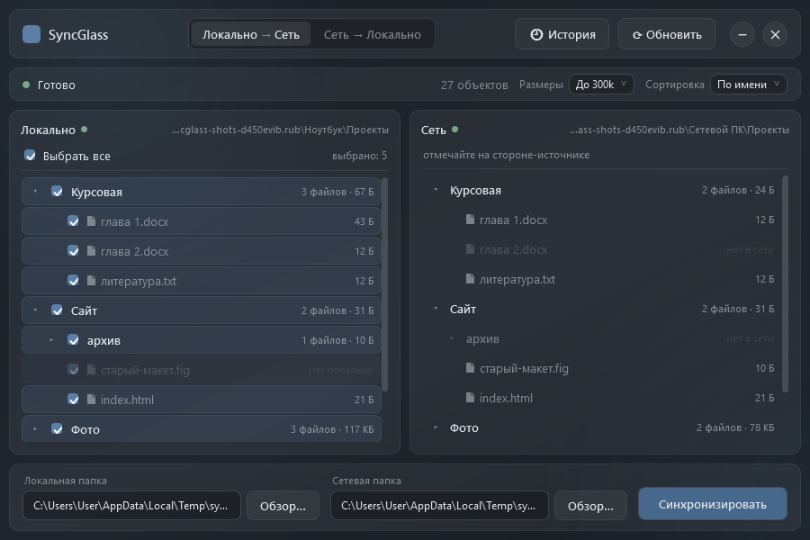

<div align="center">

# SyncGlass

**Folder sync between a laptop and a networked PC. The destination becomes an exact copy of the source, moves are recognised as moves, and the Stop button puts everything back the way it was.**

[Download for Windows](https://github.com/ALEXalesha/SynchronizationApp/releases/latest) &nbsp;·&nbsp; [Русская версия этого файла](README.ru.md)

[](https://github.com/ALEXalesha/SynchronizationApp/actions/workflows/ci.yml)
[](https://github.com/ALEXalesha/SynchronizationApp/releases/latest)
[](LICENSE)



</div>

> **The interface is in Russian**, and so is the long write-up, [README.ru.md](README.ru.md), which this file summarises. In the screenshot, «Локально» is the local side, «Сеть» the network side, «Локально → Сеть» the direction, and «Синхронизировать» the sync button.

## What it does

The local folder is on the left, the network folder on the right. Tick what to sync on the source side, pick the direction, and press Sync. New files are copied, changed ones overwritten, and files that no longer exist on the source are deleted from the destination.

- **Moves are recognised.** If a file or a whole folder was moved, the destination does the same by renaming instead of deleting and copying again. A pair is matched by size and name, counted only when the match is unique, and checked by content before it becomes a move.
- **A preview comes first**: how many files will be moved, copied, overwritten and deleted, with a live counter while it runs. Nothing changes without confirmation. Large counts are printed with digit grouping and a smaller font, and "of N" goes on its own line while running: a six-digit count used to spill out of its tile (fixed in 1.0.1).
- **Stop undoes the run.** Originals are not destroyed straight away: during the run they sit in a service folder `.sgundo` inside the destination and are thrown away in one go only at the very end. Stop brings back what was overwritten and deleted and removes what was copied; if a run crashed, the next start clears up after it.
- **Folder-versus-file conflicts are resolved.** If `Reports` is a folder on one side and a file on the other, the destination clears the spot first and then puts the right thing there.
- **Names are case-insensitive**, as in Windows itself: `Docs` and `docs` are the same folder.
- **The window opens where it was closed** (1.1.0). The saved place is checked against the monitors present now: if that monitor has been unplugged, the window opens centred on the main one, and its title bar always stays on a screen. The rule is the same module as in the author's calculators and Paint Pro, with property tests over random screen layouts.
- **Sizes are counted without eating memory** (1.1.1). The background scan used to queue a task for every file at once: on a folder with 300,000 entries the process grew to 700 MB and the scan took 33 seconds. Now a fixed number of workers take the next folder or file from a stack: the same scan takes 5.5 seconds with a peak of 140 MB.
- **An unreachable side blocks the run.** A missing folder reads as empty, and syncing against an empty side would delete everything on the other one.



**Deletion is permanent, and the preview always says so.** It used to go to the Windows Recycle Bin, but the bin refuses network paths, so network deletions went direct and the two sides were told apart by the look of the path. The same share mapped as a drive letter (`Z:`) did not match that rule: the preview promised the Recycle Bin while the deletion bypassed it. A promise that depends on which of two spellings a network folder has is worse than no promise, so the Recycle Bin was removed entirely: one behaviour everywhere, one warning everywhere.

## Two versions (1.2.2)

Since 1.2.0 SyncGlass comes in two builds that do the same job and share everything:

| | Electron | C# / WPF |
|---|---|---|
| Code | repository root: `main.js`, `renderer/`, `src/` | `csharp/` |
| Download | `SyncGlass Setup 1.2.2.exe`, `SyncGlass-1.2.2-portable.exe` | `SyncGlass-CSharp-Setup-1.2.2.exe`, `SyncGlass-CSharp-1.2.2-portable.exe` |
| Tests | 202 on `node --test` | 258 on xUnit |

- **One set of files.** Settings, history, the size cache and the window position live in `%APPDATA%\SyncGlass` in one format; the C# contract tests read files written by the Electron version itself.
- **One running copy.** Both take the same single-instance lock (a named pipe), so the two windows can never sync the same folders at once; starting the second brings the first to the front.
- **One version number** for both, checked by a test against `package.json`, the C# project and the C# installer.
- **Ported law by law.** The C# version passes the same thirteen randomized laws and the laws of scale. One deliberate difference: sizes and dates come from the folder listing instead of a separate request per file, which saves a round trip per file on a network share.



## Tests

```powershell
npm install
npm test
```

202 tests in fifteen files, all on `node --test` with no test dependencies. The logic lives in `src/` and is tested directly; `main.js` and `renderer.js` are loaded with Electron and the DOM stubbed, so no real Electron is needed.

Two files are worth copying:

- **`invariants.test.js` - thirteen laws over random trees.** Not "check a scenario" but "state a law and try to break it": the destination becomes an exact copy; a second run finds nothing to do; stopping at any point restores the destination exactly; the plan built from the background index equals the plan from a live scan; with randomly failing file operations no file disappears from both sides; the preview's per-branch counters add up to its header. Later laws click random nodes through the real renderer and compare what the row shows with what happens on disk, change the tree between the phases of a run, and check that a name with angle brackets never reaches the markup raw. One law guards its own generator: if too few runs reach the case it exists for, it fails itself.
- **`memory.test.js` - the law of scan memory.** The tree grows fourfold (files in one folder, or the number of folders) and the test counts how many promises wait at the same time. A healthy scan stays flat; a scan that queues a task per file grows with the tree. Both scan paths and the dated folder listing are measured, plus two checks that the worker scan answers exactly like the old one.
- **`scaling.test.js` - laws of scale.** One input dimension grows while the others stay fixed, and the real preview handler is timed on both paths. Healthy code stays flat (x1.2); anything that loops over exclusions inside a loop over branches grows fourfold. The same run counts repeated disk reads, which on a network share cost the most. The law was checked with three mutations, one of them a defect from an earlier review, caught without naming its location.

The C# tests: `dotnet test csharp/SyncGlass.sln` (.NET 8 SDK). Besides the ported laws they open the real WPF window and check that no dark text sits on the dark glass and that a tree row is laid out like the Electron one.

## Running and building

```powershell
npm install
npm start
npm run dist            # installer and portable exe into dist/
```

C# version:

```powershell
dotnet run --project csharp/src/SyncGlass.Wpf
dotnet publish csharp/src/SyncGlass.Wpf -c Release -r win-x64 --self-contained true -p:PublishSingleFile=true -p:IncludeNativeLibrariesForSelfExtract=true -p:EnableCompressionInSingleFile=true -o csharp/dist
ISCC.exe csharp/installer/SyncGlass.iss   # installer into csharp/dist/
```

The build is unsigned, so SmartScreen may warn on first launch ("More info" → "Run anyway").

## Screenshots are generated

`tools/make-screenshots.js` starts the real app with a separate temporary `userData`, so your settings, caches and history are untouched, and gives it two invented folders, "Laptop" and "Network PC". To be precise, the "network" side there is a second local folder: the script has no real share. The app reads a UNC path and a local one the same way, but it would be wrong to present it as a network. The frame is taken from the page itself with `webContents.capturePage()`; a screen grab could catch someone else's window.

```powershell
npx electron tools/make-screenshots.js
dotnet run --project csharp/tools/SyncGlass.Screenshots   # the C# frames, same invented folders
```

The preview screenshot also exposed a small defect: its list and the history window still had the light system scrollbar over the dark glass, because the dark style was set on the trees only. It now applies to every scrolling list.

## Stack

Electron · vanilla JavaScript · `node --test` · electron-builder

C# 12 · .NET 8 · WPF · CommunityToolkit.Mvvm · xUnit · Inno Setup

## Changelog

What changed in each release: [CHANGELOG.md](CHANGELOG.md).

## Licence

MIT, see [LICENSE](LICENSE).
